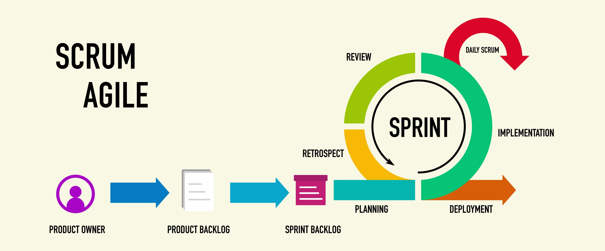

# Metodología Scrum
Scrum es un marco de trabajo (Framework) diseñado para ayudar a los equipos a trabajar juntos de manera ágil. Se basa en el aprendizaje a traves de la experiencia y en la entrega incremetal de resultado para resolver problemas complejos.

## 1. ¿Qué es la metodología Scrum?
Es un marco de trabajo liviano. Se fundamenta en tres pilares: **Transparencia, Inspección y Adaptación**. En lugar de trabajar planificando un proyecto de meses paso a paso, el equipo trabaja en ciclos cortos para recibir retroalimentación constante y ajustar el rumbo si es necesario.

## 2. ¿Qué es un Sprint?
Es el Sprint es el corazon de la metodología Scrum master. Es un tiempo de intervalo fijo generalmente de 1 a 4 semanas durante el cual el equipo crea un incremento de producto utilizable y valioso. Una vez que se termine un sprint el otro comienza inmediatamente. 

## 3. El Ritmo de Trabajo (Eventos/Ceremonias)
* **Daily (Scrum Diario):** Es para sincronizarse, la regla de oro es que sea corta, (máximo 15 min). Se enfoca en:
    1. ¿Qué se logro ayer?
    1. ¿Qué voy a logar hoy?
    1. Tengo algún blocker o stopper, esto es importante para ver como solucionar para avanzar

* **Weekly:** Muchas empresan la usa para dar un vistaso general a la semana, revisar métricas o alinear objetivos con otros equipos. Es una pausa para vel bosque completo.

## 4. La Jerarquía del Trabajo (De lo macro a lo micro)
Imaginemos que el proyecto es un edificio.

| Nivel | Nombre           | Analogía de la Casa                                                                 | Explicación en Software                                              |
|------|------------------|--------------------------------------------------------------------------------------|----------------------------------------------------------------------|
| 1    | Epic (Épica)     | "Construir la cocina".                                                               | Es un objetivo grande que toma varios meses o Sprints.               |
| 2    | Feature          | "Instalación de gas y estufa".                                                       | Una funcionalidad que el usuario nota (ej. El buscador de una App).  |
| 3    | User Story       | "Como cocinero, quiero una estufa de 4 hornillas para cocinar varios platos a la vez". | Describe quién quiere algo, qué quiere y para qué.                   |
| 4    | Task (Tarea)     | "Comprar manguera de gas", "Apretar tuercas".                                       | Son los pasos técnicos que tú haces. El cliente no los ve, pero son necesarios. |

* el equipo se sienta a "picar" esa Épica en trozos pequeños.

* Una Épica se divide en varias User Stories.

* Una User Story se divide en varias Tasks.

## 5. El Inventario (Backlog)
* **Producto log:** Es la lista maestra. Todo lo que el cliente sueña o necesita esta ahí esperando a ser priorizado.

## 6. Backaclog Refinement
Cuando llegamos a la mitad del tiempo del Sprint, hacemos esto para identificar las tareas que ya hicimos y cuales son las que falta. Con las tareas pendientes hacemos un top de cuales son las más urgentes y demás, para comenzar con estas.

## 7. Los 3 Roles de Scrum

| Rol                         | Responsabilidad Principal                                                                 | Metáfora                                                                                  |
|----------------------------|--------------------------------------------------------------------------------------------|-------------------------------------------------------------------------------------------|
| Product Owner (PO)         | Maximizar el valor del producto. Es quien decide qué se hace y prioriza el Backlog.       | El Dueño del Restaurante: sabe qué platos quiere ofrecer y cuáles son más rentables.     |
| Scrum Master (SM)          | Facilitar el proceso. Ayuda a que el equipo entienda Scrum y elimina los stoppers (bloqueos). | El Entrenador: no juega el partido, pero se asegura de que los jugadores tengan todo para ganar. |
| Developers (Equipo de Desarrollo) | Crear el incremento técnico. Son los profesionales que deciden cómo construir lo que pide el PO. | Los Cocineros: usan su técnica para preparar los platos con la mejor calidad.             |

* **¿Cómo interactuan?**
El **_PO_** trae las necesidades del cliente, los **_Dev_** aportan la magia técnica y el **_SM_** cuida que la comunicación y el método fluyan sin problemas

## 8. Ejercisios

## El Lanzamiento de un Videojuego Móvil

**Contexto:** Un estudio quiere lanzar un juego de carreras.  

**Tu reto:** Definir qué hace el Product Owner en este caso y cómo "picar" la Épica "Modo Multijugador" en Historias de Usuario.

* **La Épica principal es:** Modo Multijugador en Línea. Como esto es demasiado grande para un solo Sprint, el Product Owner (PO) debe trabajar con el equipo para "picarla".

    * `La función del PO es mazimizar el valor de un producto para el cliente`

* Imagina que el equipo de programadores quiere dedicar tres semanas solo a mejorar los gráficos de los árboles del paisaje, pero los usuarios están pidiendo a gritos poder competir contra sus amigos. **¿Qué crees que debería priorizar el PO en este caso: los detalles de los árboles o la función de competir contra amigos? ¿Por qué?**

    * `nuestra brújula como PO es el valor de negocio y la satisfacción del usuario. Aunque unos árboles hermosos son agradables, el modo multijugador es lo que realmente hará que los usuarios descarguen, jueguen y recomienden el juego.`

* Para poder trabajar en el siguiente sprint, el equipo de desarollo necesita que el **_PO_** pique esa Épica en **User Stories** más pequeñas.

* Una user history suele seguir este formato:**_Como [usuario], quiero [acción] para [beneficio]._**

    * `User Story: "Como jugador, quiero crear una sala de juego para invitar a mis amigos o esperar a otros oponentes."`

* Ahora para que los developers puedan trabajar en esto un sprint, necesitamos el desglose técnico. El equipo te pregunta ¿Qué paso atómicos tengo que programar para que esto funcione?

* **Task**
    * **_Frontend:_** Crear el botón de "Crear Sala" y la interfaz de espera (Lobby)
    * **_Backend:_** Programar el algoritmo de matchmaking que agrupa jugadores por región y completa con bots si es necesario.
    * **_Backend:_** Crear el sistema de validación para no exceder el tope máximo de la sala. 

---

## Organizando un Festival de Música

**Contexto:** Un equipo debe coordinar bandas, seguridad y venta de entradas.  

**Tu reto:** Identificar quién sería el Scrum Master y cómo manejar un stopper crítico en la Daily (ej: se canceló el artista principal).

---

## Creando una App de Banco Digital

**Contexto:** Se necesita una función para que los usuarios envíen dinero por número de celular.  

**Tu reto:** Escribir una User Story completa y desglosarla en al menos 3 Tasks técnicas.

---

## Rediseño de una Tienda de Ropa Online

**Contexto:** La página actual es lenta y los clientes se quejan.  

**Tu reto:** Simular una Sprint Retrospective. ¿Qué preguntas harías al equipo para mejorar el proceso de trabajo en el siguiente Sprint?

---

## Desarrollo de un Robot de Cocina Inteligente

**Contexto:** El hardware ya está listo, pero falta el software que descarga recetas.  

**Tu reto:** Priorizar el Backlog. De una lista de funciones, ¿cuáles irían al primer Sprint y por qué?